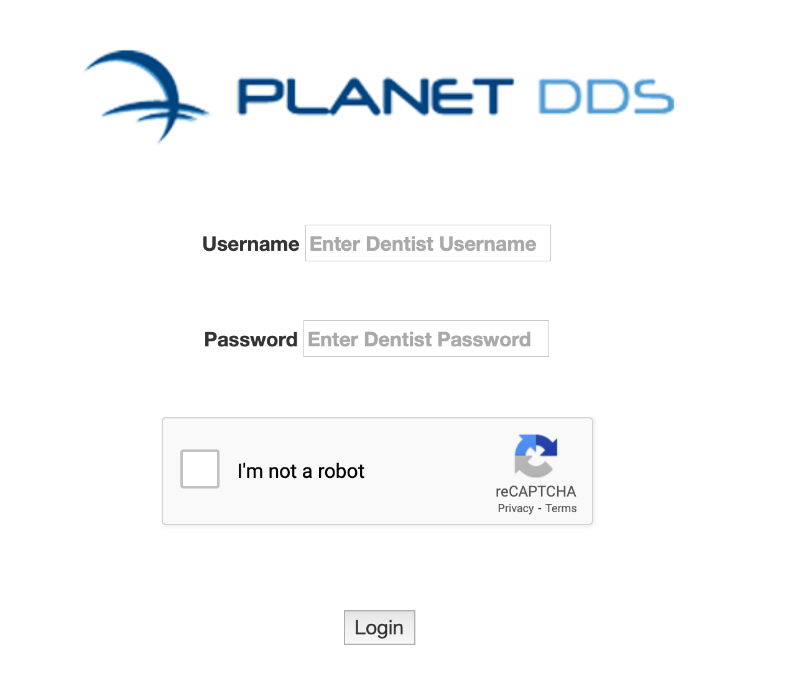
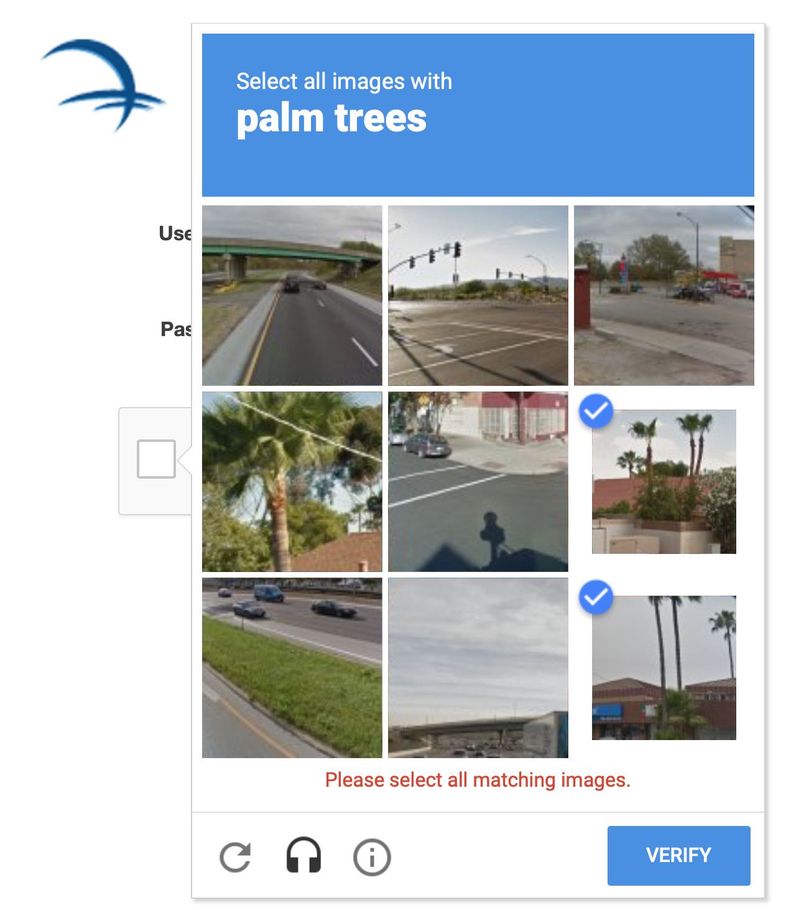
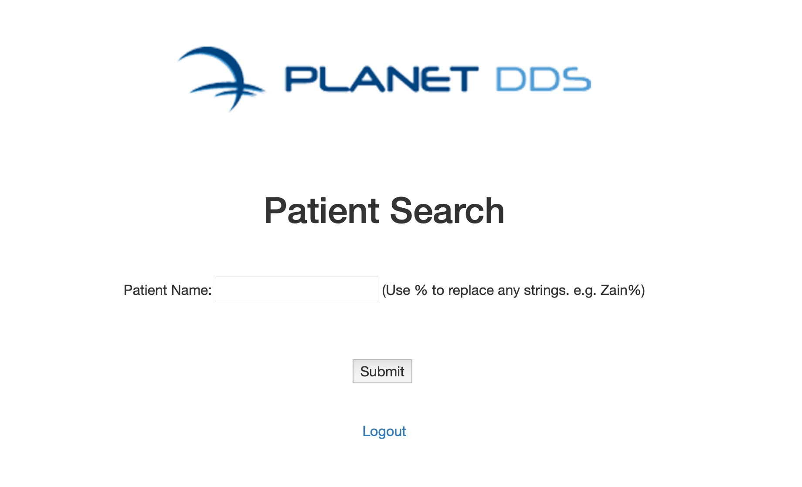

## Zain Siddiqui: Planet DDS Take Home Project

This website serves as a proof of concept for a patient management application for dentists.

### Tech Stack
Backend: Java, Java Servlets, SQL (MySQL)

Frontend: JavaScript, AJAX, HTML, Bootstrap, jQuery

Hosting/Cloud: Amazon Web Services (EC2), Google ReCAPTCHA, Tomcat Web Server

Version Control: Git, GitHub

Concepts Incorporated: REST APIs (proper use of GET and POST HTTP requests), JSON (for log in verification and database retrieval), strong authentication (user sessions, log in filter, Google ReCAPTCHA)

Database Schema:

Patient Table

	id integer NOT NULL AUTO_INCREMENT,

	firstName varchar( 50 ) NOT NULL DEFAULT '',

	lastName varchar( 50 ) NOT NULL DEFAULT '',

	address varchar( 200 ) NOT NULL DEFAULT '',

	email varchar( 50 ) NOT NULL DEFAULT '',

	PRIMARY KEY( id )

Dentist Table

	firstName varchar( 50 ) NOT NULL DEFAULT '',

	lastName varchar( 50 ) NOT NULL DEFAULT '',

	username varchar( 50 ) NOT NULL DEFAULT '',

	password varchar( 100 ) NOT NULL DEFAULT '',

	PRIMARY KEY( username )

### Login screen

Username/Password to login: AdminDentist, password: mypassword

The dentist is directed to the log in screen initially. Here, a valid dentist user name and valid dentist password must be provided. These are checked using the MySQL database that exists within the AWS EC2 instance in which this appplication runs on.

This appliacation utilizes user sessions! If a user tries to access the "index.html" page or any other page wihtout logging in, the application takes the user back to the log in screen. This is for security reasons, as we do not want patient records to be exposed when someone is not logged in with something as easy as a URL bypass.

Google ReCAPTCHA is also utiliazed on the log in screen! Google ReCAPTCHA is a service that prevents bots from attacking websites by verifying that the user "is not a robot." As such, users must fill out the ReCAPTCHA portion of the login screen to continue.

### Main Page

The main page of the application allows dentists to search for patients. The patients live inside the patient table, which is also part of the MySQL database with the AWS EC2 instance in which this application runs on. There are 500+ sample patients in the database to search for. To see all of the patients, enter "%" (since % replaces any string). To search for a specific patient, try searching for "Zain".

The log out button ends the current user session and redirects the user to the log in page. Since the application validates according to sessisons, trying to manually bypass the login by manually inputting a URL will NOT work.

Done By: Zain Siddiqui. September 6, 2020.
